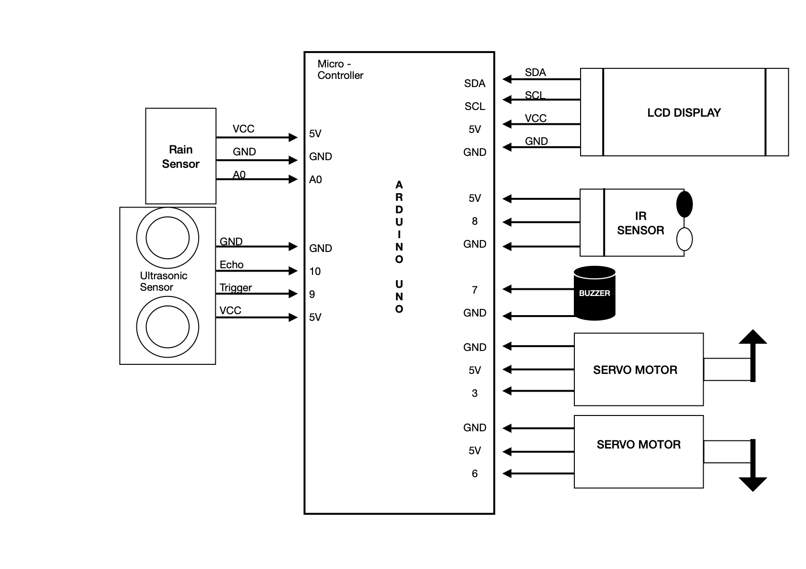
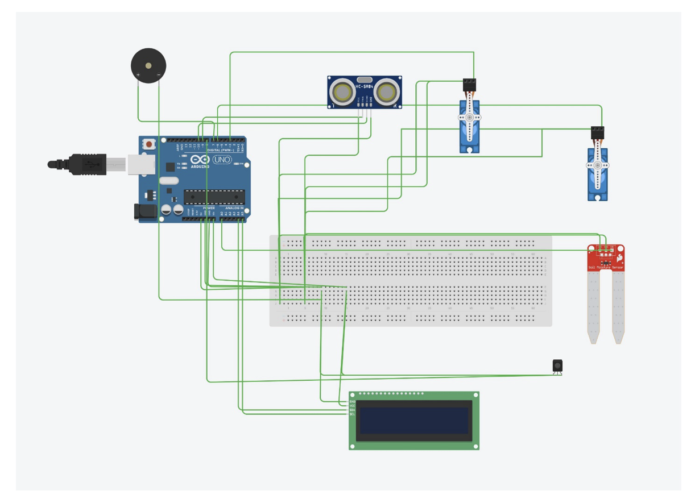

# ♻️ Smart Waste Segregation & Automation System (IoT Smart Bin)

An IoT-based **Smart Waste Segregation & Automation System** that automatically detects, classifies, and segregates waste into **wet and dry categories** using sensors and servo-based automation.  
This project promotes hygiene, reduces human interaction, and supports **smart city initiatives**.

---

## 📌 Project Overview
The Smart Waste Bin uses **sensor fusion and automation** to enable touchless waste disposal.  
When a user approaches the bin, the lid opens automatically. The system then detects whether the waste is **wet or dry** and routes it to the appropriate compartment.

---

## 🎯 Objectives
- Automate waste disposal using IoT sensors  
- Segregate waste into wet and dry categories  
- Reduce manual waste handling  
- Improve hygiene and environmental sustainability  

---

## ⚙️ Features
- 🚪 Automatic lid opening using ultrasonic sensor  
- 💧 Wet waste detection using moisture sensor  
- 🧱 Dry waste detection using IR sensor  
- 🔄 Servo-controlled waste segregation  
- 🔔 Buzzer indication during operation  
- 📟 LCD display for system status  
- ♻️ Fully touchless and automated system  

---

## 🛠️ Hardware Components
- Arduino / ESP32 / ESP8266  
- Ultrasonic Sensor  
- IR Sensor  
- Moisture Sensor  
- Servo Motors (2)  
- Buzzer  
- 16×2 LCD Display  
- Power Supply  
- Dustbin Structure  

---

## 🧠 Working Principle
1. Ultrasonic sensor detects user presence  
2. Lid opens automatically using a servo motor  
3. Waste is analyzed:
   - Moisture sensor → Wet waste  
   - IR sensor → Dry waste  
4. Servo motor directs waste to the correct bin  
5. LCD displays waste type and system status  
6. Buzzer alerts user during operation  

---
## connections
## 📷 Project Image

## cad image

---

## 🌍 Applications
- Smart cities  
- Public places (malls, parks, stations)  
- Hospitals  
- Educational institutions  
- Residential waste management  

---

## 🚀 Future Enhancements
- Cloud-based bin monitoring  
- Mobile app integration  
- AI-based waste classification  
- GPS-enabled smart bins  
- Municipal alert system  

---

## 💻 Technologies Used
- Embedded Systems  
- Internet of Things (IoT)  
- Sensor Integration  
- Automation & Control  

---

---

## 👨‍💻 Author
**Prem Sai Reddy Kolli**  
IoT & Embedded Systems Enthusiast  

---

## ⭐ Support
If you find this project useful, please ⭐ star the repository and contribute!
